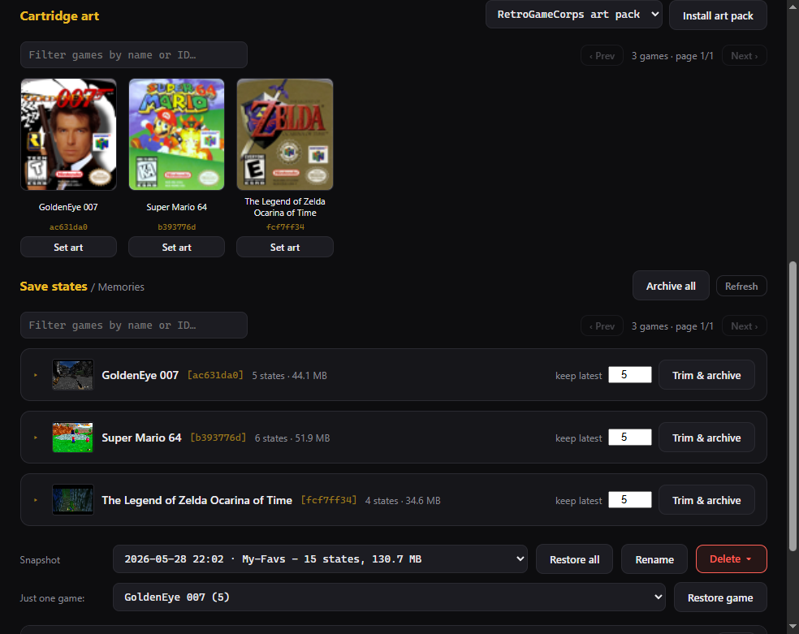

<p align="center">
  
</p>

# Analogue 3D Desktop

A desktop GUI for the Analogue 3D — a point-and-click, black-and-gold interface
for updating the console, flashing the 8BitDo 64 controller, managing save
states, installing cartridge art, and backing it all up. It's the friendly face
on the same engine as the [Analogue 3D Utility](https://github.com/auntiepickle/Analogue3DUtility)
CLI: the shared `analogue3d` Python package does the real work, and this app is a
[pywebview](https://pywebview.flowrl.com/) window over it.

## Features

- **Updates** — see the console firmware on the card and the controller firmware
  vs. the latest available, with an "up to date / update available" badge. Update
  console firmware, and flash one or *all* connected controllers to any official
  version (downgrades included) with a live, determinate progress bar.
- **Backups** — zip up Library, Settings, and Memories (save states); restore a
  backup; delete one or keep only the latest.
- **Save states (Memories)** — a per-game, paginated, filterable browser with
  screenshot thumbnails. Take a **snapshot** of every save state and restore the
  whole thing or just one game; trim a game to its newest N; delete individual
  states. Destructive actions take a safety snapshot first.
- **Cartridge art** — a paginated gallery of your games' box art. Install the
  [RetroGameCorps](https://github.com/retrogamecorps/Analogue-3D-Images) art pack
  or a custom URL, or set a **custom image per cartridge**.
- **Auto** — one click runs the lot (back up incl. save states, console firmware,
  art pack, every controller) with a live step checklist.
- **Settings** — a configurable backup location (defaults to
  `~/Documents/Analogue3D`), shared with the CLI.
- Live device detection (plug/unplug), styled in-app dialogs, and an app icon.

## Screenshots

<p align="center">
  
</p>
<p align="center">
  
</p>
<p align="center">
  
</p>

## Download

Grab the build for your OS from the
[Releases page](https://github.com/auntiepickle/Analogue3DDesktop/releases) — no Python needed:

- **Windows** — `Analogue3DDesktop-windows.exe`. Uses the built-in **Edge WebView2 runtime**
  (ships with Windows 11 and current Windows 10).
- **macOS** — `Analogue3DDesktop-macos.zip`; unzip and open the `.app` (it's unsigned, so the
  first launch is right-click → Open).
- **Linux** — **run from source** (below). pywebview's GTK/WebKit backend doesn't bundle into
  a portable binary reliably, so there's no Linux download.

## Run from source

```sh
pip install pywebview
pip install analogue3d        # the engine (or: pip install -e ../Analogue3DUtility)
python app.py
```

On Windows it uses the built-in Edge WebView2 runtime — nothing else to install.

## Build a standalone binary

```sh
pip install pyinstaller
python build.py
```

This produces a single windowed executable in `dist/`
(`Analogue3DDesktop.exe` on Windows). It bundles the engine, the web UI, the icon,
and the pywebview backend, so it runs with nothing else installed — on Windows the
target machine just needs the Microsoft Edge WebView2 Runtime (ships with Windows 11
and current Windows 10).

## How it's wired

- `app.py` — launches the native window and sets the taskbar identity + icon.
- `api.py` — the `Api` class exposed to JavaScript (`window.pywebview.api.*`).
  Read-only methods return data; action methods run an engine task, stream
  progress, and return its captured log.
- `web/` — `index.html`, `style.css`, `app.js`: the interface.
- `build.py` — the PyInstaller build.

The CLI (`python a3d.py` in the core repo) and this GUI are two faces on the same
`analogue3d` engine.
