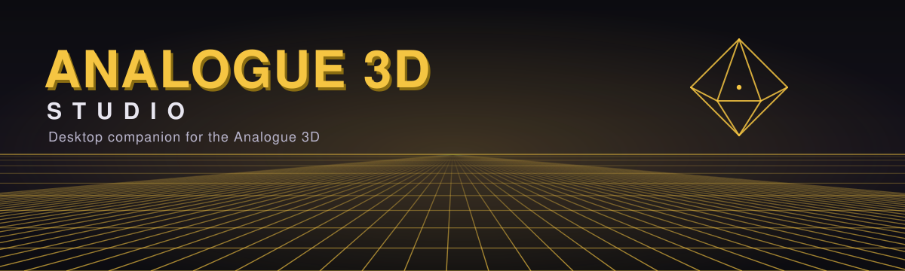
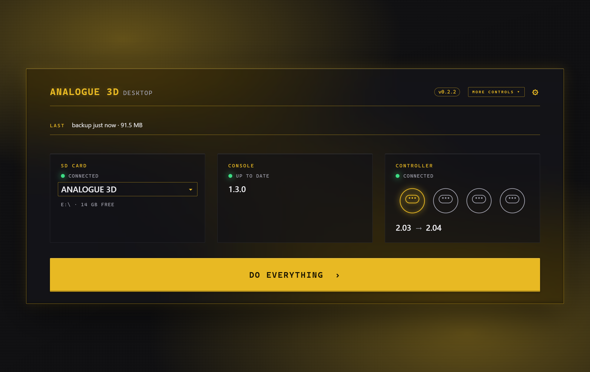
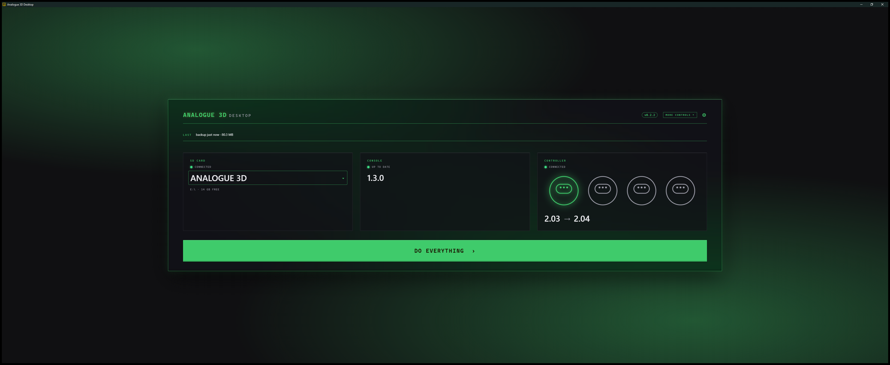
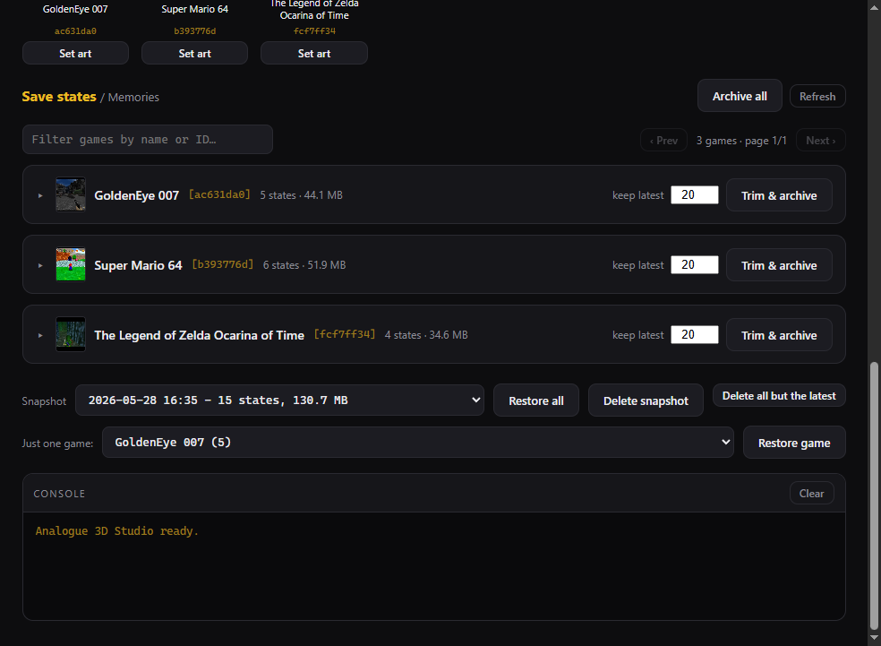

<p align="center">
  
</p>

# Analogue 3D Desktop

**One button to keep your Analogue 3D current — or every knob if you want them.**

A desktop app for the Analogue 3D — in any of ten accent themes mirroring the
console's own editions. Update the console, flash your 8BitDo 64 controllers,
back up save states, and install cartridge art — in **Minimal mode** (one big
DO EVERYTHING button) or **Tinker mode** (every control on one panel). It's
the friendly face on the same engine as the
[Analogue 3D Utility](https://github.com/auntiepickle/Analogue3DUtility) CLI.

## Two faces, one engine

<table>
  <tr>
    <td width="50%" valign="top">
      <p><b>Minimal — for the shelf.</b> SD card, console, controller. One DO EVERYTHING button. Hand it to anyone.</p>
      
    </td>
    <td width="50%" valign="top">
      <p><b>Tinker — for the bench.</b> Every firmware version, every controller slot, every cartridge's art on one panel.</p>
      
    </td>
  </tr>
</table>

### Memories — the save-state browser

Per-game, paginated, filterable, with screenshot thumbnails. Snapshot the lot before you touch anything; trim a game to its newest N; restore one game or all of them.

<p align="center">
  
</p>

## What you can do

> **Nothing destructive runs without a safety snapshot first.**

- **Update the console** — see the firmware on the card vs. the latest with an "up to date / update available" badge; flash with a live, determinate progress bar.
- **Flash every controller at once** — one or *all* connected 8BitDo 64s to any official version, downgrades included.
- **Browse every save state with its screenshot** — paginate, filter, snapshot everything before risky business, then restore one game or the whole library.
- **Install cartridge art** — pull the [RetroGameCorps](https://github.com/retrogamecorps/Analogue-3D-Images) pack, or set a custom image per cartridge.
- **Back up the SD card** — Library, Settings, and Memories zipped into one archive; restore or clean older backups in place.

The **AUTO** action (and Minimal mode's **DO EVERYTHING** button) runs the lot — back up, update console, install art, flash every controller — with a live step checklist. Backup location is configurable (defaults to `~/Documents/Analogue3D`) and shared with the CLI.

## Colorways

Ten accent themes mirror Analogue 3D, Analogue Pocket, and N64 Funtastic editions. Switch in Settings.

<p align="center">
  
</p>

## Download

Grab the latest build from the
[**Releases page**](https://github.com/auntiepickle/Analogue3DDesktop/releases/latest) — no Python needed.

- **Windows** — `Analogue3DDesktop-windows.exe`. Uses the built-in Edge WebView2 runtime (ships with Windows 11 and current Windows 10).
- **macOS** — download `Analogue3DDesktop-macos.dmg`, open it, drag **Analogue 3D Desktop** into Applications, **right-click → Open** the first time. Done.
- **Linux** — run from source (below).

<details>
<summary>First-run notes — Gatekeeper, signing, self-update</summary>

The macOS build is ad-hoc signed (so it won't be flagged as "damaged") but not yet notarized, hence the one-time right-click → Open. To skip the Gatekeeper prompt entirely, download with `curl` (curl downloads aren't quarantined):

```sh
curl -L -o ~/Downloads/Analogue3DDesktop.dmg \
  https://github.com/auntiepickle/Analogue3DDesktop/releases/latest/download/Analogue3DDesktop-macos.dmg
```

Once installed, the app updates itself from within — it pulls `Analogue3DDesktop-macos.zip` automatically.

Linux: pywebview's GTK/WebKit backend doesn't bundle into a portable binary reliably, so there's no Linux download — run from source instead.
</details>

## For developers

```sh
pip install pywebview
pip install analogue3d        # the engine (or: pip install -e ../Analogue3DUtility)
python app.py
```

On Windows it uses the built-in Edge WebView2 runtime — nothing else to install. See [CONTRIBUTING.md](CONTRIBUTING.md) for the demo + theme env vars, testing notes, and how to build a standalone binary.

The CLI (`python a3d.py` in the core repo) and this GUI are two faces on the same `analogue3d` engine — `api.py` is the thin bridge from JavaScript to engine tasks; `web/` is the interface.

## Design language

Built around an **instrument-panel** metaphor — hi-fi hardware, not a dashboard. Mono uppercase labels, hairline borders, one accent at a time.

- [**docs/BRANDING.md**](docs/BRANDING.md) — six brand pillars, voice rules, the wordmark.
- [**docs/THEMING.md**](docs/THEMING.md) — how the 10 themes work, rules when adding an 11th.
- [**docs/REDESIGN.md**](docs/REDESIGN.md) — what the dual-mode UI redesign changed and why.
- [**docs/CLI-UPDATES.md**](docs/CLI-UPDATES.md) — landing the same language in the CLI (separate PR).
